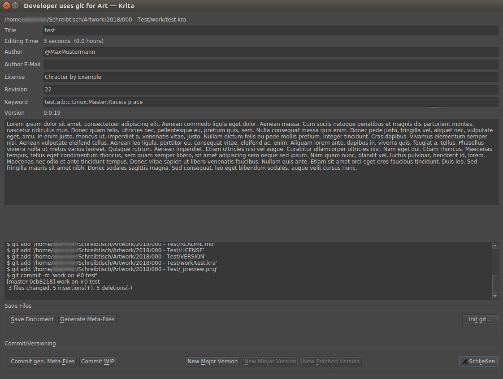
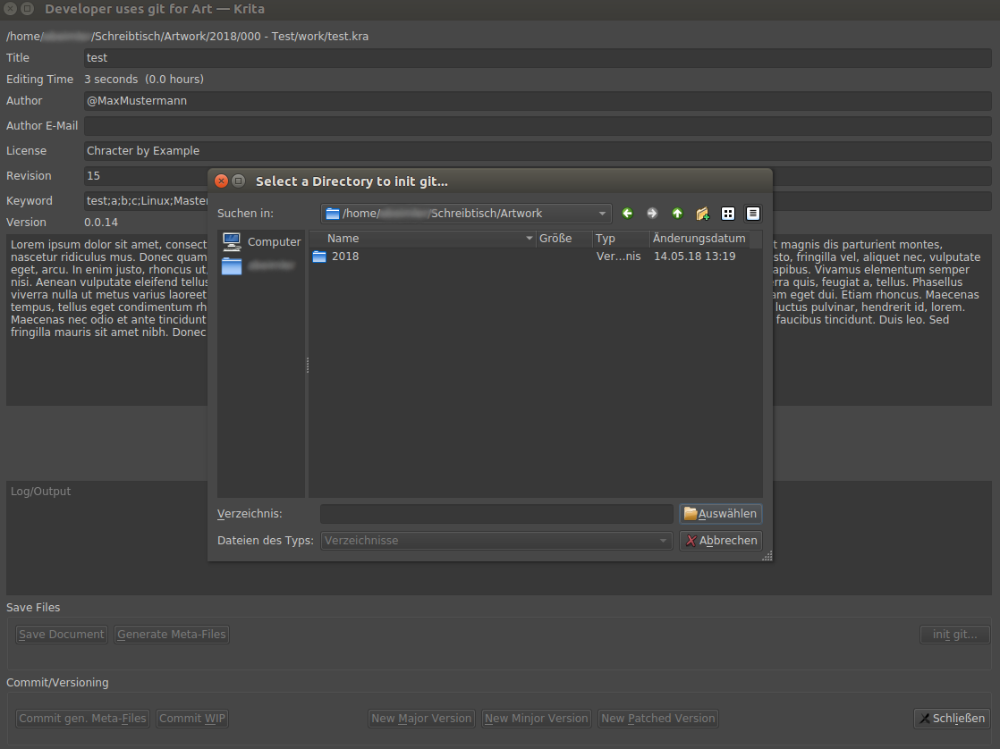
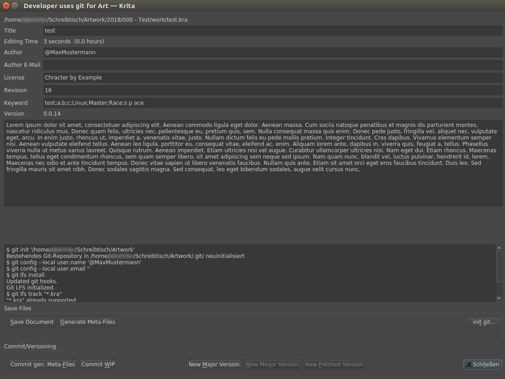

# DURRA - Developer Uses Revision contRoll for Art(-Projects)

It's a Krita 4.x Python Plugin for revision control your Artwork and a bit more.  



## Usage/Example


## Installation
### Requirements

 - python 3.x
 - Krita 4.x
 - Qt5.x
 - git
 - git-lfs

#### Krita 4.0.0 on Linux

Download the zip file and copy the **durra** folder and the **durra.desktop** file into the following location:

~~~
~/.local/share/krita/pykrita
~~~

Enable plugin: **Settings > Configure Krita... > Python Plugin Manager > durra**

#### Krita 4.0.0 on Windows

Download the zip file and copy the **durra** folder and the **durra.desktop** file into Krita's *Resource Folder* (Settings > Manage Resources > Open Resource Folder). It's usually a folder somewhere in the hidden AppData folder.


Enable the plugin: **Settings > Configure Krita... > Python Plugin Manager > durra**

> You may need to restart Krita


# Setup

I use a bit custom directory structure for my Artwork.
(But of cause you can use your own :) )

**My artwork directory structure:**

```markdown
 - Artwork/
    - 2018/
        - 001 - MyArtwork/
            - work/
                - myartwork.kra
            - <generated files goes here>
```


**or something like this:**

```markdown
 - Artwork/
    - 2018/
        - 001 - MyArtwork/
            - myartwork.kra
            - <generated files goes here>
```

_Why do I have this `work/`-directory? Simple, so I can export different fileformats like .psd, .sai, ... or for multiple version of this work `myartwork_v2.kra`._  
_I also numbered my directories to keep it in order_

> The importing thing is, your `.kra` file need it's own directory.

> Don't forget to Setup your Author-Settings

https://docs.krita.org/Author_Settings

## revision control

### git

Before you can version control your art, you must install [git](https://git-scm.com/book/en/v2/Getting-Started-Installing-Git) 
and [git-lfs](https://git-lfs.github.com/).

> install git on Linux/Ubuntu

```shell
$ sudo apt install git-all

$ curl -s https://packagecloud.io/install/repositories/github/git-lfs/script.deb.sh | sudo bash
$ sudo apt-get install git-lfs
$ git lfs install
```

> You can use the UI to `git init`  





**or via terminal**

```shell
$ cd YourArtWorkFolder
$ git init
$ git lfs install
$ git lfs track "*.kra"
$ git lfs track "*.psd"
```

See [git - Setup Manuelly](#git-setup-manually) for more details.


## How To Use

Goto **Tools > Scripting > DURRA**  

### Document Info

- **filename** filename of active Document
- **Title** Title
- **Editing Time** Total editing (format: "X hours Y seconds")
- **Author** Author Nickname
- **License** License/Rights
- **Revision** Document current Revision number
- **Keyword** Keywords (Use ';' (Example: Linux;Master;Race))
- **Version** current Version (see VERSION-File)
- **Description** Description

You can edit this Document Information in: **File > Document Information**
### Use this Buttons

Use these 2 Buttons for the workflow:  

1. If you're in your WIP-Phase, use the **Commit WIP**-Button.  

2. If you're done and want to "publish" your work/commission, use the **New Major Version**-Button.  
After your first "release" (version `1.0.0`) you can use the other **New ... Version**-Buttons.


## Features

### revision control (git/svn)
#### Versioning

The Versioning should be very simple, based on the [Semantic Versioning](https://semver.org/).

At the beginning you're in the **WIP**(Work in Progress)-Phase and only save your files with in the version `0.1.x`.  
Every "step"/commit/revision change the `0.1.x` version.  

If you finished your work, you simply make an update to the MAJOR-Version `1.0.0`, after this step, you can only update the MAJOR, MINJOR or PATCH-Version.

 - MAJOR-Version: Totally new Version with Major changes like changing the Foundation in total.
 - MINJOR-Version: Additional changes like adding new stuff/characters and add/remove "features".
 - PATCH-Version: Just quick fixes.

_finished/final-version means you published your work or the commission is done._

#### <a name="git-setup-manually"></a> git - Setup Manually


Before you can version control your art, you must install [git](https://git-scm.com/book/en/v2/Getting-Started-Installing-Git).  
and [git-lfs](https://git-lfs.github.com/), then initial it.

> install git and git-lfs on Linux/Ubuntu

```shell
$ sudo apt install git-all

$ curl -s https://packagecloud.io/install/repositories/github/git-lfs/script.deb.sh | sudo bash
$ sudo apt-get install git-lfs
$ git lfs install
```


> setup your (git) user-info (optional)

You don't need to set this up if you are using the DocumentInfo Author-Settings, every commit includes the author.

https://git-scm.com/book/en/v2/Getting-Started-First-Time-Git-Setup

```shell
$ git config --global user.name "John Doe"
$ git config --global user.email johndoe@example.com
```


> After installation, 
you need to initialize git in your Project-directory(`001 - MyArtwork/`) or (better) in your Artwork-directory(`Artwork/`).

```shell
$ cd Artwork/
$ git init
$ git lfs track "*.kra"
$ git lfs track "_preview.png"
```

_For more information about `git lfs`, see [Configuring Git Large File Storage](https://help.github.com/articles/configuring-git-large-file-storage/)_


#### SVN

> TODO


### generated files

One of the features of this Plugin is, it generates meta-files.  
Those files are just txt-files, so you can easily search for keywords or other project information in your repository.


**My artwork directory with generated files:**

```markdown
 - Artwork/
    - 2018/
        - 001 - MyArtwork/
            - work/
                - myartwork.kra
            - _preview.png
            - MyArtwork.png
            - MyArtwork_v1.0.1.png
            - TITLE
            - DESCRIPTION.md
            - DESCRIPTION.html
            - DESCRIPTION.bbcode
            - KEYWORD
            - LICENSE
            - README.md
            - VERSION
```


#### 001 - MyArtwork/

Project-directory of your Artwork.  
The number is not only to keep it in order, it's also for "tagging" your work. (later in the commit)  

#### work/

Workspace of your Artwork.
_If you us a `work/`-directory, the files get generated in the directory above._  
You can also save `.psd`-files as a mirror of your work here.

#### _preview.png

exported `png` file of your current Artwork.   
Good for preview your work later in your repository or later for [a comparison](https://blog.github.com/2011-03-21-behold-image-view-modes/).

#### MyArtwork.png, MyArtwork_v1.0.1.png, ...

final/patched version of your Artwork.  

#### TITLE

Document Info: Title.

**Example:**

```markdown
My Artwork Title
```


#### DESCRIPTION

Document Info: Description.  
The description is saved in different formats (markdown, bbcode and html), it's really annoying if different Sites, uses different formats, so you can't copy&past the description.

**Example (markdown):**

```markdown
### TestArt

An h1 header
============

Paragraphs are separated by a blank line.

2nd paragraph. *Italic*, **bold**, and `monospace`. Itemized lists
look like:

  * this one
  * that one
  * the other one

Note that --- not considering the asterisk --- the actual text
content starts at 4-columns in.

> Block quotes are
> written like so.
>
> They can span multiple paragraphs,
> if you like.

Use 3 dashes for an em-dash. Use 2 dashes for ranges (ex., "it's all
in chapters 12--14"). Three dots ... will be converted to an ellipsis.
Unicode is supported. ☺
```

**Example (bbcode):**

```bbcode
[b]TestArt[/b]
[size=200][b]An h1 header[/b][/size]
Paragraphs are separated by a blank line.

2nd paragraph. [i]Italic[/i], [b]bold[/b], and monospace. Itemized lists
look like:

  * this one
  * that one
  * the other one

Note that --- not considering the asterisk --- the actual text
content starts at 4-columns in.

[quote]Block quotes are
written like so.[/quote]
>
[quote]They can span multiple paragraphs,
if you like.[/quote]

Use 3 dashes for an em-dash. Use 2 dashes for ranges (ex., "it's all
in chapters 12--14"). Three dots ... will be converted to an ellipsis.
Unicode is supported. ☺
```


**Example (html):**

```html
<h3>TestArt</h3>

<h1>An h1 header</h1>

<p>Paragraphs are separated by a blank line.</p>

<p>2nd paragraph. <em>Italic</em>, <strong>bold</strong>, and <code>monospace</code>. Itemized lists
look like:</p>

<ul>
<li>this one</li>
<li>that one</li>
<li>the other one</li>
</ul>

<p>Note that --- not considering the asterisk --- the actual text
content starts at 4-columns in.</p>

<blockquote>
  <p>Block quotes are
  written like so.</p>
  
  <p>They can span multiple paragraphs,
  if you like.</p>
</blockquote>

<p>Use 3 dashes for an em-dash. Use 2 dashes for ranges (ex., "it's all
in chapters 12--14"). Three dots ... will be converted to an ellipsis.
Unicode is supported. ☺</p>
```


#### KEYWORD

Document Info: Keyword.

**Example:**

```markdown
art drawing fanart krita
```


#### LICENSE

Document Info: License/Rights.

**Example:**

```markdown
Character by ThisOtherPerson
Art by @Me
```


#### VERSION

current Artwork Version.

**Example:**

```markdown
1.0.1
```

#### README.md

Summary of Document Info and some more Informations.

**Example:**

```markdown
# TestArt test {0 hours} #a #b #c #d 

## Description


### TestArt

An h1 header
============

Paragraphs are separated by a blank line.

2nd paragraph. *Italic*, **bold**, and `monospace`. Itemized lists
look like:

  * this one
  * that one
  * the other one

Note that --- not considering the asterisk --- the actual text
content starts at 4-columns in.

> Block quotes are
> written like so.
>
> They can span multiple paragraphs,
> if you like.

Use 3 dashes for an em-dash. Use 2 dashes for ranges (ex., "it's all
in chapters 12--14"). Three dots ... will be converted to an ellipsis.
Unicode is supported. ☺


## More Infos

Date: 30.03.2019  
Duration: 17 minutes 55 seconds (0 hours)  
  
  
## Credits

Art by Me  
  
  
## Keywords
a b c d  
  
  
## Keywords (Hashtags)
#a #b #c #d   

```


## Limitation

 - can't edit DocumentInfo
 - can't edit Version-Number (directly)
 - editing-cycles/revision counts messed up (?)
 - works only with git


## Future

With this meta-files and export images, you can
upload your Art to Sites like DeviantaArt and Mastodon via API.


 ## Links
  - https://github.com/spaceottercode/kritatoot
  - https://github.com/juancarlospaco/krita-plugin-bashactions#krita-plugin-bashactions
  - https://kritascripting.wordpress.com/2018/03/22/bbds-krita-script-starter/
  - https://www.youtube.com/watch?v=thhm4AOujW4 (Draw with Jazza - How to Organize your Files and Folders)

## License

[](http://doge.mit-license.org)

- **[MIT license](http://opensource.org/licenses/mit-license.php)**
- Copyright 2018 © <a href="http://github.com/abeimler" target="_blank">abeimler</a>.